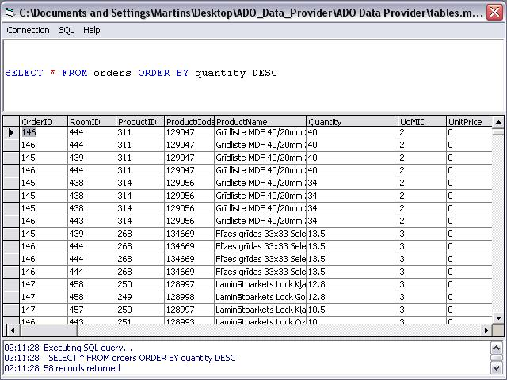



## ADO Data Provider

### Description

This is a small application that uses ADODC control to connect to Access, Excel etc. ODBC data sources and execute SQL statement on them. The DataGrid control are used to display returned data.

The application has it's own simple SQL code keyword formatter, logging and other features. Small, efficient and robust.

Could be a good example of how to use ADO object to connect to DB, execute SQL queries against data in DB and handle the returned data.
 
### More Info
 

             |
---                |---
**Submitted On**   |2006-06-01 19:30:02
**By**             |[Martins Skujenieks](https://github.com/Planet-Source-Code/PSCIndex/blob/master/ByAuthor/martins-skujenieks.md)
**Level**          |Intermediate
**User Rating**    |4.5 (36 globes from 8 users)
**Compatibility**  |VB 5\.0, VB 6\.0
**Category**       |[Databases/ Data Access/ DAO/ ADO](https://github.com/Planet-Source-Code/PSCIndex/blob/master/ByCategory/databases-data-access-dao-ado__1-6.md)
**World**          |[Visual Basic](https://github.com/Planet-Source-Code/PSCIndex/blob/master/ByWorld/visual-basic.md)
**Archive File**   |[ADO\_Data\_P199807612006\.zip](https://github.com/Planet-Source-Code/martins-skujenieks-ado-data-provider__1-65539/archive/master.zip)

